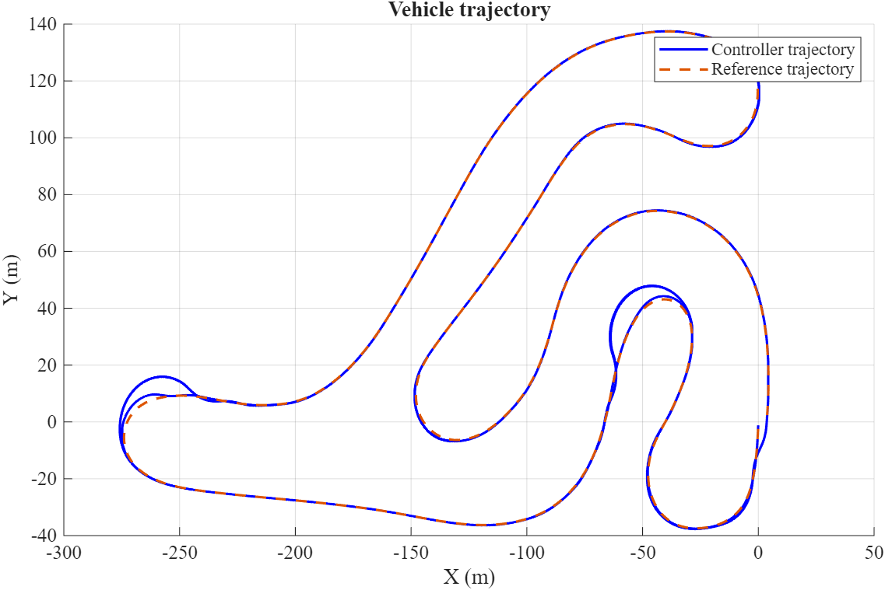
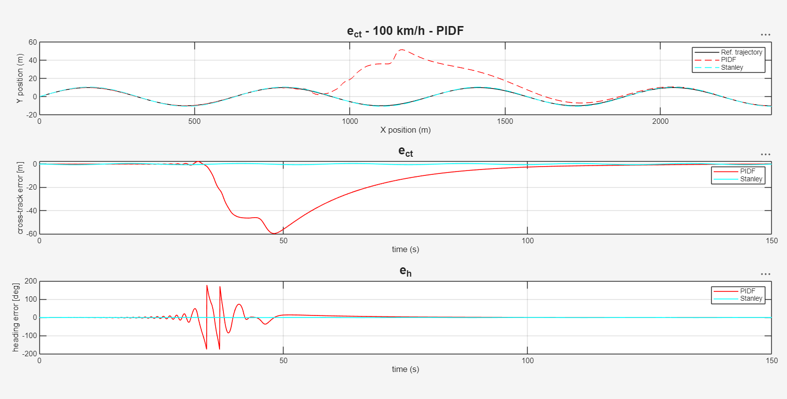
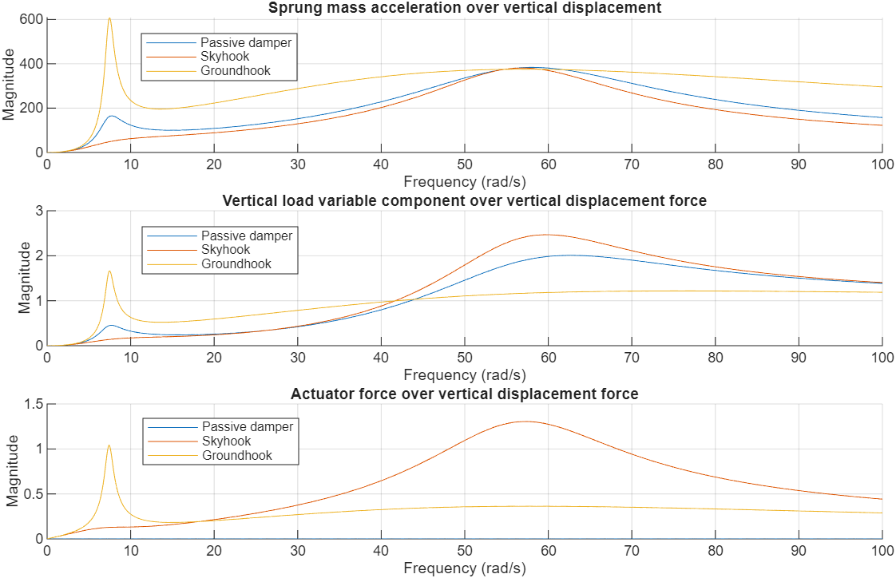
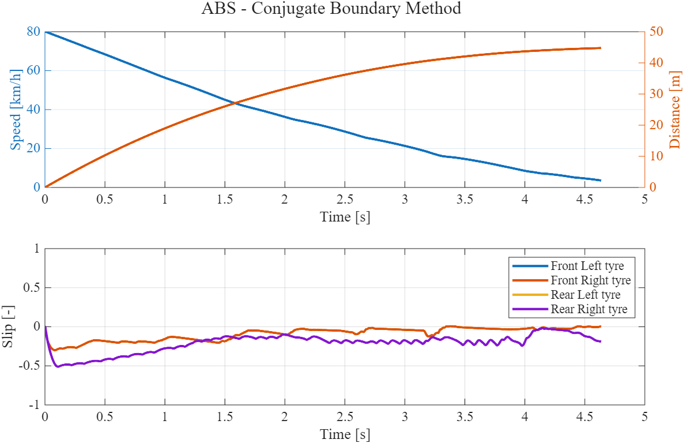
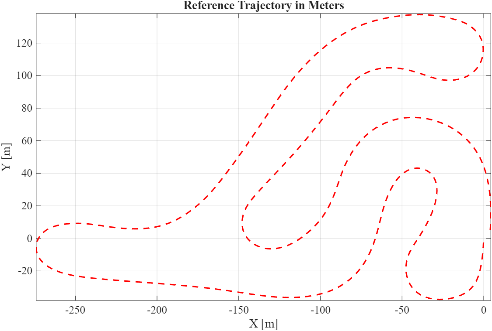
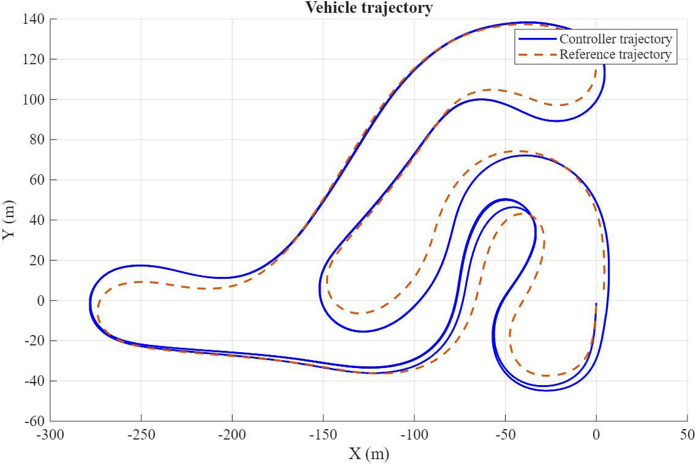
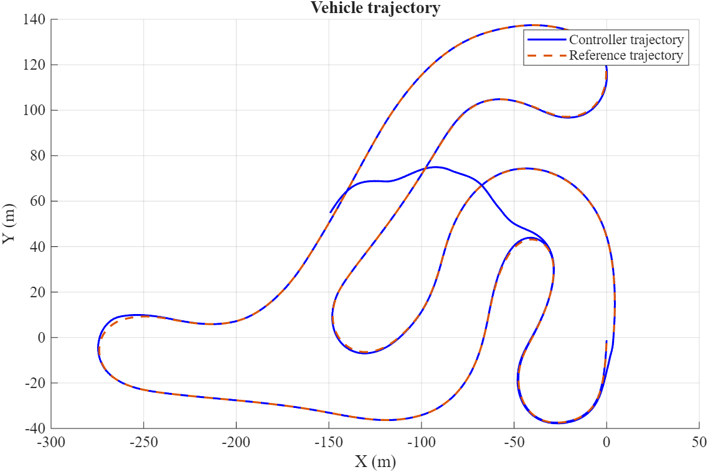
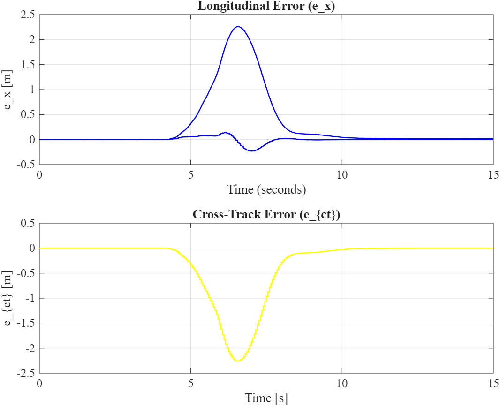
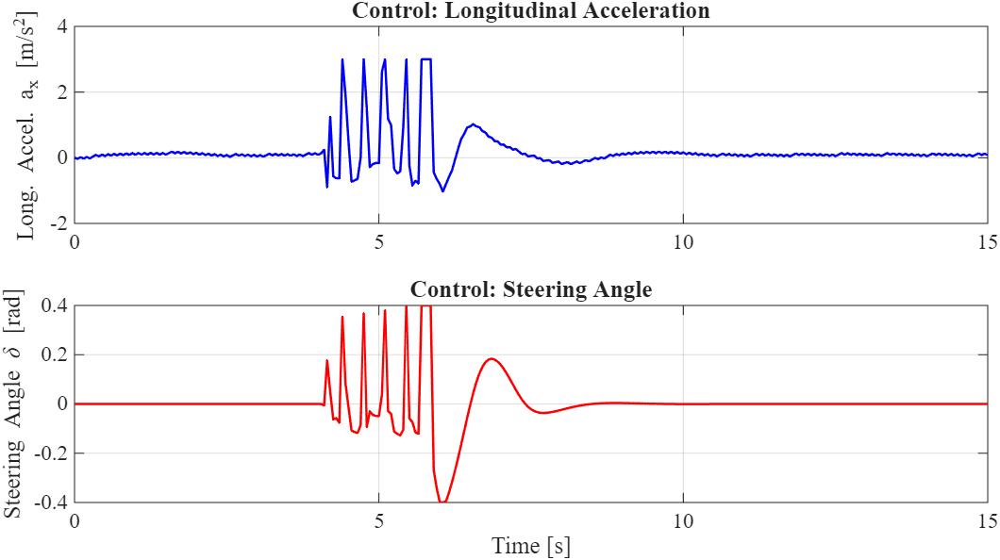

# Vehicle Dynamics & Driver Assistance Control

MATLAB/Simulink projects on vehicle dynamics modelling and ADAS control, developed for the course
**Driver Assistance Systems Design** (MSc in Automotive Engineering, Politecnico di Torino, A.Y. 2025/26).

The work goes from vertical dynamics (semi-active suspension) to lateral control (lane keeping, track
following, NMPC) and longitudinal control (adaptive cruise control, ABS).

📄 **Full report (79 pages):** [`Reports/DASD_projects.pdf`](Reports/DASD_projects.pdf)

<p align="center">
  
  
</p>

---

## Overview

| # | Project | Topics | Tools |
|---|---------|--------|-------|
| 01 | [Quarter-car suspension](#01--quarter-car-modelling-and-semi-active-suspension-control) | Skyhook / groundhook, MR damper, frequency response | MATLAB, Simulink, Symbolic Math |
| 02 | [Lateral dynamics & lane keeping](#02--lateral-dynamics-and-lane-keeping-control) | Bicycle model, Pacejka tyre, PDF/PIDF, Stanley | MATLAB, Simulink, Control System Toolbox |
| 03 | [Adaptive cruise control](#03--adaptive-cruise-control) | Constant time-gap policy, plant inversion + PI, ISO 15622 | MATLAB, Simulink |
| 04 | [Anti-lock braking system](#04--anti-lock-braking-system) | Slip control, conjugate boundary method | MATLAB, Simulink, Stateflow |
| 05 | [Track following](#05--track-following-on-a-real-circuit) | GPS track, PID/PD, Stanley, LQR (Bryson's rule) | MATLAB, Simulink, Control System Toolbox |
| 06 | [NMPC trajectory tracking](#06--nmpc-trajectory-tracking-with-obstacle-avoidance) | Nonlinear MPC, obstacle avoidance | MATLAB, Simulink, Automated Driving Toolbox |

---

## 01 — Quarter-car modelling and semi-active suspension control

📁 [`01-quarter-car-suspension`](01-quarter-car-suspension)

A 2-DOF quarter-car model (m<sub>s</sub> = 400 kg, m<sub>u</sub> = 50 kg) is used to study ride comfort and road holding
in three steps:

- **Frequency response**: passive, skyhook and groundhook configurations compared through transfer
  functions and eigenvalue analysis. Skyhook damps the chassis mode, groundhook the wheel mode.
- **Road excitation and real-world skyhook**: time-domain simulation on a random road profile, then a
  skyhook law on a semi-active damper (dissipative constraint only). It reduces the RMS chassis
  acceleration by **≈ 8 %** with c<sub>s</sub> ≈ 2000 Ns/m.
- **Nonlinear MR damper**: a current-controlled magneto-rheological damper, with the gain K<sub>p</sub> and the
  base current I<sub>c</sub> tuned on bump and random profiles (compromise: K<sub>p</sub> ≈ 0.3, I<sub>c</sub> ≈ 0.5–1 A).
  The system is then linearised at the two current extremes and analysed with Bode plots.

<p align="center">
  
</p>

## 02 — Lateral dynamics and lane-keeping control

📁 [`02-lateral-dynamics-lane-keeping`](02-lateral-dynamics-lane-keeping)

**Part 1: lateral dynamics.** The cornering stiffness is identified from Pacejka tyre data (`TireData.xlsx`)
at the static axle loads. A linear bicycle model is then built and analysed: state space at 80 km/h,
root loci versus speed, step steer and steady-state gains. The vehicle is understeering, and the sideslip
gain changes sign at about 80 km/h.

**Part 2: lane keeping.** A single-track model with linear tyres (DST) and one with Pacejka tyres (DSTP)
are compared in open loop. Lane-keeping controllers are then designed and tested on a sinusoidal reference
at 65 and 100 km/h:

| Controller | Input | 65 km/h | 100 km/h (gains not re-tuned) |
|---|---|---|---|
| PIDF | e<sub>ct</sub> | best: \|e<sub>ct</sub>\|<sub>max</sub> ≈ 0.035 m | 60 m transient, slow recovery |
| PIDF | e<sub>ct</sub> + e<sub>h</sub> | ≈ 0.05 m | **unstable** |
| PDF | e<sub>ct</sub> + e<sub>h</sub> | ≈ 0.16 m | stable, growing oscillation |
| Stanley | e<sub>ct</sub>, e<sub>h</sub> | ≈ 0.16 m, smoothest steering | **best**: < 0.05 m |

The linear controllers tuned at 65 km/h do not hold up at 100 km/h. Stanley does, because its
cross-track term depends explicitly on the speed.

## 03 — Adaptive cruise control

📁 [`03-adaptive-cruise-control`](03-adaptive-cruise-control)

A full ACC stack on a nonlinear longitudinal vehicle simulator:

- **High level**: constant time-gap (CTG) spacing policy, h = 2.7 s, λ = 0.8.
- **ISO 15622:2018 block**: minimum-speed gate, 2 s FIR filter on deceleration, jerk limiter
  (2.5 m/s³) and saturation to [−3.5, +2.0] m/s².
- **Low level**: inversion of the longitudinal model to throttle and brake commands. Inversion alone
  leaves a ≈ 0.3 m/s² acceleration bias (model mismatch). Adding a PI loop (τ<sub>v</sub> = 0.2 s) removes it: the
  steady-state error falls below 0.02 m/s² on the mild profile and 0.30 m/s² on the aggressive one,
  and the time gap stays within ±0.05 s of the target.

<p align="center">
  
</p>

## 04 — Anti-lock braking system

📁 [`04-abs`](04-abs)

- **Open-loop braking**: effect of brake command, brake distribution, mass and drag (±15 %), and
  geared vs neutral stop.
- **Slip controller**: wheel-slip regulation around σ<sub>r</sub> = −0.2 (friction peak). The gain is tuned for
  minimum stopping distance and has to be re-tuned on wet roads (−1450 dry → −700 wet).
- **Conjugate boundary method**: a deployable ABS that uses only wheel acceleration. It is a Stateflow
  IDLE / RELEASE / REAPPLY state machine that keeps the slip in the useful band without slip estimation:
  **≈ 45 m** on wet and **≈ 140 m** on snow from 80 km/h, with no sustained wheel lock.

<p align="center">
  
</p>

## 05 — Track following on a real circuit

📁 [`05-track-following`](05-track-following)

The lateral controllers are applied to the GPS trace of the **Franciacorta Karting Track** (Italy):

- **Reference**: latitude/longitude converted to local metres (flat-earth approximation), smoothed
  with a moving average, and the reference heading computed from the path tangent.
- **PID / PD and Stanley** (`PID_Stanley_track.m`) on cross-track + heading error.
- **LQR** (`lqr_track.m`) on a dynamic single-track error model (states e<sub>ct</sub>, ė<sub>ct</sub>, e<sub>ψ</sub>, ė<sub>ψ</sub>), with
  weights from Bryson's rule (e<sub>ct,max</sub> = 0.5 m, e<sub>ψ,max</sub> = 4°, δ<sub>max</sub> = 4°). The LQR gains are then
  expressed as an equivalent filtered PD controller.

The vehicle is a passenger-car model (1575 kg), so on a karting layout it is run at **30 km/h**. At
higher speeds the tightest hairpins are not feasible. Even at 30 km/h, Stanley overshoots in the
hairpins and the LQR loses the track at the tightest one (≈ 140 s), which shows the limits of
controllers designed on a linearised error model.

<p align="center">
  
  
  
</p>

## 06 — NMPC trajectory tracking with obstacle avoidance

📁 [`06-nmpc-trajectory-tracking`](06-nmpc-trajectory-tracking)

A nonlinear model predictive controller drives a dual-track vehicle model (Vehicle Body 3DOF with tyre
lookup tables) along a straight road with an obstacle, at 70 km/h:

- **Prediction model** (`model.m`): 6-state nonlinear single-track model [X, Y, ψ, v<sub>x</sub>, v<sub>y</sub>, ω<sub>ψ</sub>],
  inputs a<sub>x</sub> and δ.
- **Tuning**: T<sub>s</sub> = 0.05 s, prediction horizon T<sub>p</sub> = 3 s, Q = diag(1, 1, 12), R = diag(0.01, 0.1),
  a<sub>x</sub> ∈ [−5, 3] m/s², |δ| ≤ 0.4 rad.
- **Result**: the vehicle moves ≈ 2.3 m sideways around the obstacle and is back on the reference
  within ≈ 6 s.

<p align="center">
  
  
</p>

> The NMPC solver (`nmpc_design_st2.p`, `nmpc_st2.p`) was provided by the course instructors as compiled
> p-code and is not part of this work.

---

## Repository structure

```
├── 01-quarter-car-suspension/        Exercise1.m, Exercise_2.m, exercise_3.m + Simulink models
├── 02-lateral-dynamics-lane-keeping/ part_1.m, part2/part2.m + Simulink models, TireData.xlsx
├── 03-adaptive-cruise-control/       main.m, DASD_B_Project_3.slx
├── 04-abs/                           Exercise_Workbook.m (.mlx), Exercise1-3.slx
├── 05-track-following/               PID_Stanley_track.m, lqr_track.m, Track_data.xlsx
├── 06-nmpc-trajectory-tracking/      main.m, model.m, sim_aut_dual_scen.slx
└── Reports/                          DASD_projects.pdf + LaTeX sources (report1-4.tex)
```

## How to run

1. Open MATLAB in the project folder you want to run.
2. Run the entry script listed above. Each script loads its own parameters and opens and simulates the
   corresponding Simulink model.
3. `05-track-following` scripts ask for the vehicle speed at startup (30 km/h was used for the figures).

**Requirements:** MATLAB/Simulink **R2025b** (the version used for development), plus Control System
Toolbox, Symbolic Math Toolbox, Robust Control Toolbox (01), Stateflow (04), Automated Driving Toolbox
and Optimization Toolbox (06).

## Author

**Dennis Bettinsoli**: modelling, controller design, MATLAB/Simulink implementation and simulations
for all projects.

The written report for projects 01–04 (`Reports/`) was co-authored with **Matteo Canestrini**.

Assignments, base vehicle models and the NMPC solver were provided by the course instructors of
*Driver Assistance Systems Design*, Politecnico di Torino.
